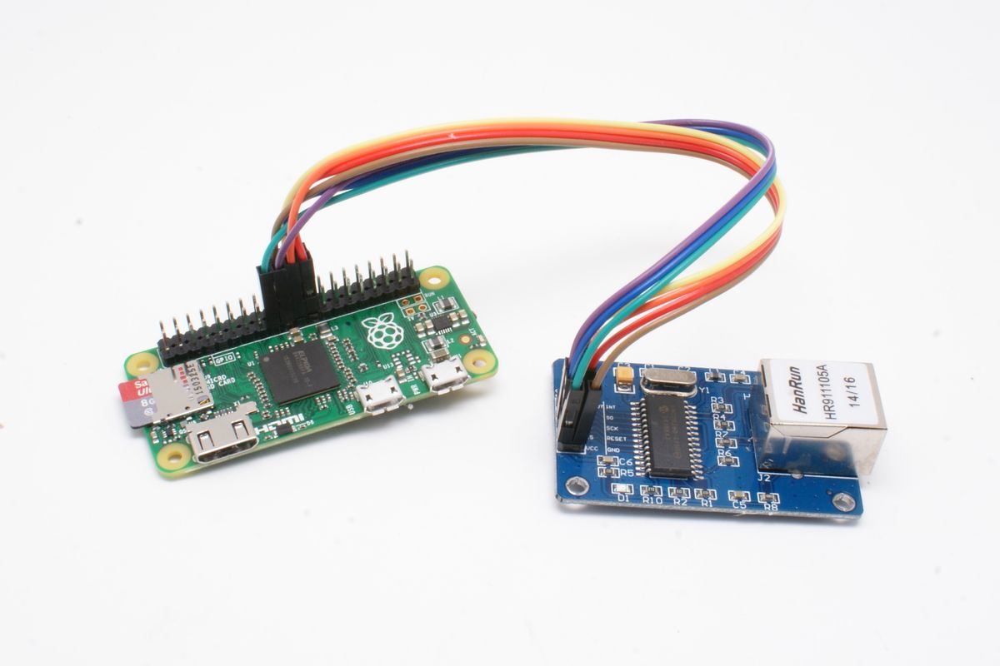
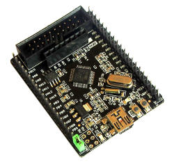
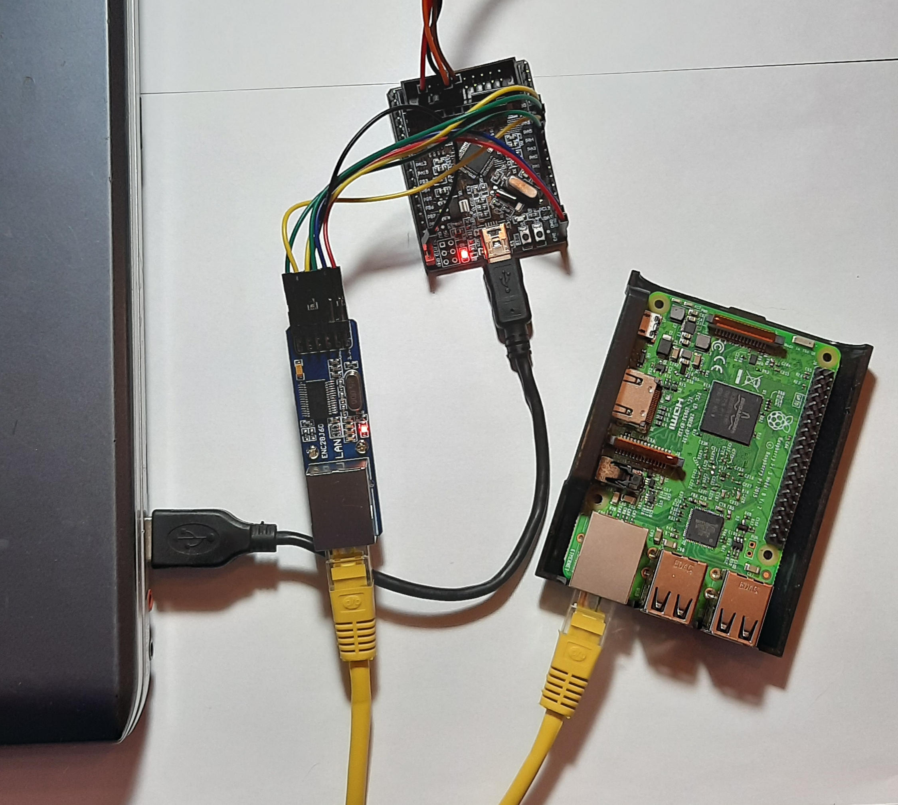

#  Making an external USB network card from ENC28J60

This is the code for the article on making an external USB ethernet adapter (https://habr.com/ru/post/530730/).

The code in this repo is subject to GPL v2 license terms.

Article translation follows.



ENC28J60 is a simple Ethernet controller that can act as an external network card for single-board computers with GPIO (there is even a ready-made driver for raspberry pi) and other Arduinos. My laptop does not have GPIO outputs, so let's try to ~~correct this drawback and~~ attach an ENC28J60 to it using an STM32F103 and a USB cable and use this setup to connect laptop to the internet.

Let's see how this can be done.

We will need:
- ENC28J60
- STM32 board with USB device support (for example, like this one)



- A Linux computer (I'm using Ubuntu 16) connected to wi-fi network
- A second computer with ethernet interface for testing internet connection (I use a raspberry pi), connected to the same wi-fi network

Wi-Fi is used for controlling raspberry pi from Linux computer, and for connecting raspberry to the internet. After all Linux computer will connect to raspberry pi via STM32 board and ENC28J60 to get its internet connection (raspberry pi will act as a router with internet connection).

I won’t describe setting up the STM32F103 (there are plenty of manuals on the Internet) and programming the ENC28J60 itself (in my example, I used this [code](https://narodstream.ru/stm-urok-68-lan-enc28j60-chast-1/) with minimal modifications). Connecting ENC28J60 to STM32F103 via SPI is described [there as well](https://narodstream.ru/stm-urok-68-lan-enc28j60-chast-1/).

## Connection
Computer (USB) -> (USB)stm32(SPI) -> (SPI)ENC28J60(Ethernet cable) -> (Ethernet)raspberry pi


## How it works
We will do without writing kernel drivers, working in user space will be enough. On the computer we will create a virtual network tap interface (layer 2, supporting ethernet frame headers) and connect our program (tap_handler.c) to it. In order for a frame to get into the Linux network stack, tap_handler just needs to write it to the tap interface. And vice versa, packets addressed to the tap interface will be read by tap_handler, which can process them somehow. As a result, tap_handler runs in an endless loop and waits for data to appear either from the tap interface or from /dev/ttyACM0 (this is the representation of our USB device in Linux). In the first case, we write the received data to /dev/ttyACM0, in the second to the tap interface.

More information about working with virtual interfaces is provided [here](https://backreference.org/2010/03/26/tuntap-interface-tutorial/) (to demonstrate how vpn works). I took the code responsible for dealing with virtual interfaces from this link as well.

We'll use CubeMX on STM32 to include libraries supporting USB CDC (virtual com port). After connecting SMT32 to computer, Linux will create a file /dev/ttyACM0 (or another number). We can read data that STM32 sent us from this file, and vice versa data written to /dev/ttyACM0 will be read by STM32.

Our STM32 firmware will work similarly. It reads data from the computer (the CDC_Receive_FS function in the usbd_cdc_if.c file) in an endless loop and write it to ENC28J60 (which in turn transmits it further to the network), and read frames from ENC28J60 and send them to the computer using the CDC_Transmit_FS function.

As far as I understand, the CDC should transmit data without errors. However, I have encountered them nevertheless. Moreover, the first packet is usually always duplicated (I have not found the reason; duplication is visible in wireshark while listening to the usb bus). Google showed that for some people this happened due to the use of an inappropriate frequency generator on STM32, which is unlikely to be the cause of the problem in my case, because I just used an external quartz. That's why I had to use labels in my code to overcome errors in data transmission (more on this below).

## Computer side
We create a network interface with the command:
```
sudo openvpn --mktun --dev tap0
```
And then assign an IP address:
```
sudo ifconfig tap0 10.0.0.1/24 up
```
### tap_handler.с
To work correctly with /dev/ttyACM0, we need to transfer data in raw form and to not allow the terminal driver to make changes to it (for example, to consider non-text data as control characters, etc.). Terminal setup:
```cpp
char cdc_name[20]="/dev/ttyACM0";
int tty_fd = open(cdc_name, O_RDWR | O_NOCTTY); 
struct termios portSettings;
tcgetattr(tty_fd, &portSettings);
cfmakeraw(&portSettings);
tcsetattr(tty_fd, TCSANOW, &portSettings);
tcflush(tty_fd, TCOFLUSH);
```
Connect tap_handler to tap0:
```cpp
/* we pass the name of the created tap0 interface in dev */
int tun_alloc(char *dev, int flags) {
    struct ifreq ifr;
    int fd, err;
    char *clonedev = "/dev/net/tun";
    /* use /dev/net/tun device */
    if( (fd = open(clonedev , O_RDWR)) < 0 ) {
        perror("Opening /dev/net/tun");
        return fd;
    }    
    memset(&ifr, 0, sizeof(ifr));

    ifr.ifr_flags = flags;
    
    /* use tap0 that has already been  created */
    if (*dev) {
        strncpy(ifr.ifr_name, dev, IFNAMSIZ);
    }
    /* connect to the interface */
    if( (err = ioctl(fd, TUNSETIFF, (void *)&ifr)) < 0 ) {
        perror("ioctl(TUNSETIFF)");        
        close(fd);
        return err;
    }
    
    strcpy(dev, ifr.ifr_name);

    return fd;
}
```
We call this function in main.c as follows:
```cpp
strcpy(tun_name, "tap0");
int tap_fd = tun_alloc(tun_name, IFF_TAP | IFF_NO_PI);
```
The IFF_TAP flag indicates the interface type (tap). The IFF_NO_PI flag is needed to prevent the kernel from adding prefix bytes before the start of the packet.

We check the presence of data in tap0 and /dev/ttyACM0. While there is no data, tap_handler is in a blocking select
```cpp
while(1) {
    int ret;
    fd_set rd_set;

    FD_ZERO(&rd_set);
    /* tap_fd - tap inteface descriptor */
    FD_SET(tap_fd, &rd_set);
    /* tty_fd - /dev/ttyACM0 descriptor */
    FD_SET(tty_fd, &rd_set);

    ret = select(maxfd + 1, &rd_set, NULL, NULL, NULL);
```

We check the source after receiving data. When receiving a frame from tap0 tap_handler generates a packet for STM32 (packet structure: the packet starts with a label - some magic 4 bytes to identify the beginning of the frame, the next 2 bytes are the length of the frame, then the frame itself follows) and writes it to /dev/ttyACM0. Then there is a short delay for data to pass through successfully.
```cpp
if(FD_ISSET(tap_fd, &rd_set)) {    
    uint16_t nread = cread(tap_fd, buffer, BUFSIZE);   
    uint8_t buf[6];
    *(uint32_t *)buf = PACKET_START_SIGN;
    *(uint16_t *)(buf + 4) = nread;    
    cwrite(tty_fd,(char *)buf,6);    
    cwrite(tty_fd, buffer, nread);
    delay_micro(delay_m);    
}
```

If there is data in /dev/ttyACM0, we make sure that it starts with the correct label (the same 4 bytes), then we read the length of the frame, and then the frame itself. We write the resulting frame to the tap interface.

```cpp
if(FD_ISSET(tty_fd, &rd_set)) {
    uint32_t sign;
    /* reading label */
    int nread = read_n(tty_fd, (char *)&sign, sizeof(sign));
    /* descriptor is closed, leaving the program */
    if(nread == 0) {        
      break;
    }
    /* if there is no match try to find label in the next four bytes */
    if(sign != PACKET_START_SIGN){       
      continue;
    }
    /* reading the frame length */
    nread = read_n(tty_fd, (char *)&plength, 2);
    if(nread == 0) {        
      break;
    }

    if (nread != 2){        
      continue;
    }    
  /* here we handle the situation when the first package is duplicated after the program start */
    if(flag){
      flag = 0;
      nread = cread(tty_fd, buffer, sizeof(buffer));
      if(nread != 6){        
        continue;
      }
    }
  /* packet length is too long, end the program */
    if(plength > BUFSIZE){      
      break;
    }

    /* read the frame (plength bytes) and write it to the tap interface */
    nread = read_n(tty_fd, buffer, plength);            
    if (nread != 0){            
        cwrite(tap_fd, buffer, nread);            
        delay_micro(delay_m);
    }
  }
```


## STM32 side

In addition to USB CDC, we will also include HAL drivers (in CubeMX) to work with SPI and LED. 

Data reception is performed in the callback CDC_Receive_FS (file usbd_cdc_if.c), which is launched by interrupts in the USB library. Long-running operations cannot be performed in this place, so we copy the incoming data into a ring buffer, take the data from the buffer in the main loop and send it out through the ENC28J60. If there is a risk of buffer overflow, the data is discarded:
```cpp

/* USB_POINTERS_ARRAY_SIZE - the size of array_pos */
/* MAX_FRAMELEN - maximum frame length */
/* USB_BUFSIZE - ring buffer size */

extern uint8_t usb_buf[]; /* ring buffer for data received from the computer */
extern uint32_t pos_int; /* index to place the next packet in the ring buffer */
extern uint32_t array_pos[]; /* a ring array of indices that point to received packets in a ring buffer */
extern uint32_t p_a; /* index of next entry in array_pos for CDC_Receive_FS */
extern uint32_t pl_a;/* index of the next entry in array_pos for the main thread */

static int8_t CDC_Receive_FS(uint8_t* Buf, uint32_t *Len)
{
  int8_t memok = 1;
  /* discard incoming data if there is not enough space in the ring buffer */
  if( pl_a !=0 && p_a !=0){
    int32_t mem_lag = array_pos[(p_a - 1) % USB_POINTERS_ARRAY_SIZE] - array_pos[(pl_a - 1) % USB_POINTERS_ARRAY_SIZE];
    if(mem_lag > USB_BUFSIZE - MAX_FRAMELEN)
      memok = 0;
  }
  /* We copy the received data to the ring buffer and
    update the array of incoming packet indices (array_pos) */
  if(*Len < USB_BUFSIZE && *Len != 0 && memok){
    uint16_t offset = pos_int % USB_BUFSIZE;
    uint16_t new_pos = offset + *Len;
    uint8_t split = 0;
    if (new_pos > USB_BUFSIZE){
      split = 1;
    }
    if(split){
      int len1 = USB_BUFSIZE - offset;
      int len2 = *Len - len1;
      memcpy(usb_buf + offset, Buf, len1);
      memcpy(usb_buf, Buf + len1, len2);
    }
    else
      memcpy(usb_buf + offset, Buf, *Len);
    pos_int += *Len;

    array_pos[p_a % USB_POINTERS_ARRAY_SIZE] = pos_int;
    p_a++;
  }
  USBD_CDC_SetRxBuffer(&hUsbDeviceFS, &Buf[0]);
  USBD_CDC_ReceivePacket(&hUsbDeviceFS);
  return (USBD_OK);
}
```

In main.c we look at the presence of data in buffer and send it via ENC28J60:
```cpp
if(pl_a < p_a){    
  uint32_t prev = 0;
  if(pl_a > 0)
    prev = array_pos[(pl_a - 1) % USB_POINTERS_ARRAY_SIZE];
  /* packet size (frame piece) received in CDC_Receive_FS */
  int32_t n = array_pos[pl_a % USB_POINTERS_ARRAY_SIZE] - prev;//usb frame size
  /* pointer to packet in buffer */
  uint8_t *from = usb_buf + prev % USB_BUFSIZE;
  /* packet correctness indicator */
  uint8_t right_n = 1;
  if (n < 0 || n > MAX_FRAMELEN){
    right_n = 0;
  }

  /* checking for a new frame. The packet must be at least 6 bytes (4 bytes signature and 2 bytes length ) */
  if((packet_len == 0) && packet_start && (n > 5) && right_n){
    /* special function for reading from a ring buffer */
    uint32_t sign = read32(from,usb_buf); 
    /* get a pointer to the data in 4 bytes */
    uint8_t *next = next_usb_ptr(from,usb_buf,4);
    /* read the frame size */
    packet_size = read16(next,usb_buf);// 2 bytes after sign is packet length
    /* discard the wrong packet */
    if (packet_size > MAX_FRAMELEN || sign != PACKET_START_SIGN){      
      packet_size = 0;
    }
    else{
      /* copy the received data packet to the frame buffer */
      next = next_usb_ptr(from,usb_buf,6);
      copy_buf(packet_buf, next, usb_buf, n - 6);      
      packet_len = n - 6;
      packet_next_ptr = packet_buf + packet_len;
      packet_start = 0;
    }

  }
  /* process subsequent packets in the frame */
  else if(packet_len < packet_size && right_n){
  /* copy the received data packet to the frame buffer */    
    copy_buf(packet_next_ptr, from, usb_buf, n);    
    packet_len += n;
    packet_next_ptr = packet_buf + packet_len;
  }
  /* discard the erroneous frame */
  else if (packet_len > packet_size){    
    packet_len = 0;
    packet_start = 1;
  }
  /* send the frame via enc28j60 */
  if(packet_len == packet_size && packet_size > 0){    
    enc28j60_packetSend(packet_buf, packet_size);
    packet_len = 0;
    packet_start = 1;
  }

  pl_a++;
}


```
and also check for the presence of data in the ENC28J60 and, if available, send it to USB and flash the LED
```cpp
len=enc28j60_packetReceive(net_buf,sizeof(net_buf));
if (len>0)
{
  *((uint16_t*)(sign_buf + 4)) = len;
  while(CDC_Transmit_FS(sign_buf, sizeof(sign_buf)) == USBD_BUSY_CDC_TRANSMIT);
  while(CDC_Transmit_FS(net_buf, len) == USBD_BUSY_CDC_TRANSMIT);
  HAL_GPIO_TogglePin(GPIOC, GPIO_PIN_13);
  
```
In CDC_Transmit_FS I changed the code a little so that the function could be placed in a while loop. At this point in CDC_Transmit_FS we return the new status USBD_BUSY_CDC_TRANSMIT instead of just USBD_BUSY. Without changes I was unable to find out whether the data was accepted for sending:
```cpp
if (hcdc->TxState != 0){
    return USBD_BUSY_CDC_TRANSMIT;
  }
```

In the ENC28J60 initialization function enc28j60_ini() we need to allow receiving and transmitting any frames, not only frames addressed to it (promiscuous mode):
```cpp
enc28j60_writeRegByte(ERXFCON,0);
```

## Configuring and testing our setup

### Raspberry
Activate eth0 and set its IP address so that it is in the same local network with tap0 interface on computer. Run ping
```
sudo ifconfig eth0 up 10.0.0.2/24
ping 10.0.0.2
```
Run tcpdump in another terminal
```
sudo tcpdump -i eth0
```
### Computer
Connect STM32 programmed with the code above to the computer, then connect ENC28J60 to raspberry with a network cable . The LED on STM32 should start blinking, indicating the arrival of arp / icmp packets (from ping on raspberry pi). Make sure that /dev/ttyACM0 appears.
```
ls /dev/ttyACM*
```

Compile and run tap_handler
```
gcc tap_handler.c -o tap_handler
./tap_handler
```
Tap_handler starts the entire chain - it picks up incoming packets from raspberry, directs them to tap0, receives a frame from it in response, sends it to STM32, and when the frame reaches raspberry we see that pings (icmp packets) begin to pass through.

## Connecting computer to the internet via our setup

If the pings (icmp packets) pass, we are ready to check the operation of our network card.
### Computer
Establish an ssh connection to raspberry pi using its local wi-fi network address. To connect our computer to the internet via our setup we need to change the default gateway (to point to raspberry pi). The browser will stop working, but connection to raspberry will not be lost
```
sudo route del default gateway 192.168.1.1
sudo route add default gateway 10.0.0.2
```

The DNS server may need to be adjusted (for example, by putting 8.8.8.8 to /etc/resolv.conf).
### Raspberry

Allow packets to move from eth0 (connected to ENC28J60) to wlan0 (connected to internet) and enable NAT
```
echo 1 | sudo tee -a /proc/sys/net/ipv4/ip_forward
sudo iptables -t nat -A POSTROUTING -o wlan0 -j MASQUERADE
```
Now check the computer. The internet should appear, although it is not fast (I have 0.5 Mbit/s). You may prefer to not bother with raspberry pi, but directly connect network cable from router to ENC28J60. But it is easier to test the setup with raspberry pi; in tcpdump running on raspberry one can see everything that is happening.

## Why do we need it?
Using such a setup in real life is probably not very convenient (especially given that there are a lot of inexpensive usb ethernet adapters around), but it was very fascinating to make it.

The STM32 part of the project was made in Atollic TrueStudio.
